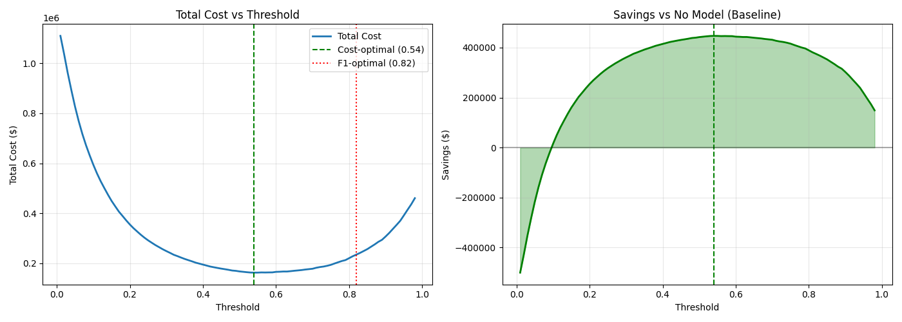
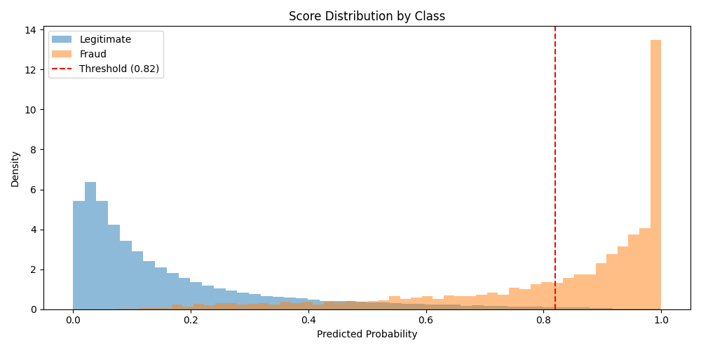

# Fraud Detection for E-Commerce Transactions


A cost-sensitive machine learning approach to transaction fraud detection, achieving **97.4% AUC** and **$447K annual savings** on the [IEEE-CIS Fraud Detection](https://www.kaggle.com/competitions/ieee-fraud-detection) dataset. 

The notebooks in the project are designed to be read and followed, with comments and markdown cells, but I have also written a more comprehensive blog post about this project at [joshuaprettyman.com/projects/fraud-detection](https://joshuaprettyman.com/projects/fraud-detection).

## Key Results

| Metric | Value |
|--------|-------|
| ROC-AUC (Holdout) | **0.9738** |
| PR-AUC | 0.7369 |
| CV Mean AUC | 0.9088 ± 0.01 |
| Cost Reduction | **73%** vs. no model |
| Annual Savings | **$446,985** |

## Problem Statement

E-commerce companies face a critical trade-off: aggressive fraud prevention blocks legitimate customers, while lenient policies increase losses. This project builds a fraud detection system that **optimizes for business impact**, not just accuracy metrics.

Key challenges addressed:
- **Severe class imbalance** (3.5% fraud rate)
- **High-dimensional data** (590K transactions, 450+ features)
- **Temporal patterns** (fraud tactics evolve over time)
- **Business constraints** (false positives have real costs)

## Approach

### 1. Exploratory Data Analysis
- Analyzed transaction patterns, card types, and device information
- Identified high-risk segments and temporal fraud patterns
- Handled 400+ anonymized features (V1-V339, C1-C14, D1-D15)

### 2. Feature Engineering
- Engineered domain-specific features from transaction metadata
- Separate pipelines for tree-based (label encoding) and linear models (one-hot encoding)
- Careful handling of missing values and categorical variables

### 3. Modeling
- **Baseline**: Logistic Regression (AUC: 0.84)
- **Final Model**: LightGBM with time-based cross-validation (AUC: 0.91)
- Time-series CV prevents data leakage from future transactions

### 4. Cost-Benefit Optimization
Traditional ML optimizes for F1 score, but business needs differ:

| Outcome | Cost |
|---------|------|
| Missed fraud (FN) | $150 (avg. fraud amount) |
| Blocked legitimate (FP) | $10 (customer friction) |
| Caught fraud (TP) | $5 (review cost) |

**Finding**: The cost-optimal threshold (0.54) differs significantly from the F1-optimal threshold (0.82), demonstrating why business context matters.



The model achieves excellent class separation, with fraud scores concentrated near 1.0 and legitimate transactions near 0.0:



## Project Structure

```
ieee-fraud-detection/
├── notebooks/
│   ├── 01_eda.ipynb                 # Exploratory data analysis
│   ├── 02_feature_engineering.ipynb # Feature engineering pipeline
│   ├── 03_modeling.ipynb            # Model training and comparison
│   └── 04_evaluation.ipynb          # Evaluation and cost analysis
├── data/
│   └── download_data.py             # Kaggle dataset download script
├── models/                          # Saved model artifacts
├── figures/                         # Generated figures
├── reports/                         # Evaluation summaries
└── requirements.txt
```

## Quick Start

```bash
# Clone repository
git clone https://github.com/yourusername/ieee-fraud-detection.git
cd ieee-fraud-detection

# Create virtual environment
python3 -m venv .venv
source .venv/bin/activate

# Install dependencies
pip install -r requirements.txt

# Download dataset (requires Kaggle API token)
python data/download_data.py
```

### Kaggle API Setup

1. Go to [Kaggle Settings](https://www.kaggle.com/settings)
2. Under "API Tokens", click "Create New Token"
3. Set the environment variable:
   ```bash
   export KAGGLE_API_TOKEN="KGAT_your_token_here"
   ```
4. Accept the [competition rules](https://www.kaggle.com/competitions/ieee-fraud-detection/rules)

## Technologies

- **Data Processing**: pandas, NumPy
- **Visualization**: Matplotlib, Seaborn
- **Machine Learning**: scikit-learn, LightGBM
- **Imbalanced Learning**: imbalanced-learn
- **Model Interpretation**: SHAP

## Dataset

The IEEE-CIS dataset contains real-world e-commerce transactions from Vesta Corporation:

| File | Records | Features |
|------|---------|----------|
| train_transaction.csv | 590,540 | 394 |
| train_identity.csv | 144,233 | 41 |
| test_transaction.csv | 506,691 | 394 |
| test_identity.csv | 141,907 | 41 |

## License

MIT License - see [LICENSE](LICENSE) for details.

## Acknowledgments

- [IEEE Computational Intelligence Society](https://cis.ieee.org/) and [Vesta Corporation](https://trustvesta.com/) for the dataset
- Kaggle community for insights and discussion
